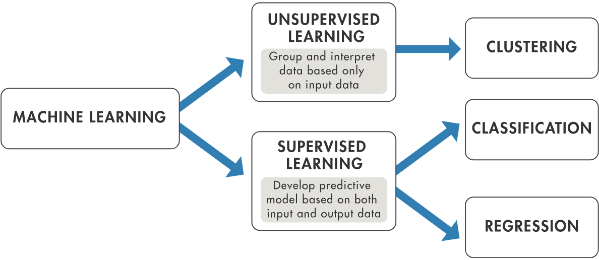

# Machine-Learning Repository
**Author: Marcelo Guarido**

This is a tutorial in machine learning using self-created functions comparing the results with the Turicreate package. 

All examples are done using the Jupyter Notebook and the python 2.7. To use the Turicreate, it is required a Linux or MacOS system. For Windows 10, you can the WLS (Ubuntu bash terminal for Windows 10). To use the WLS in your windows 10, you can use this [tutorial](https://www.howtogeek.com/249966/how-to-install-and-use-the-linux-bash-shell-on-windows-10/). That is the way I run it.

I like to use the Jupyter Notebook to run the analyzes. To install it on Linux or on the WLS, follow the instructions of this [link](https://conda.io/docs/user-guide/install/linux.html).

To install the Turicreate, please follow the instructions of this [link](https://github.com/apple/turicreate/).
***

## Machine Learning

In this machine learning tutorial, I am uploading the notebooks in different folders with the dataset used for the analysis. I will be uploading new codes as soon they are created and tested. They are based on the [machine learning course](https://www.coursera.org/specializations/machine-learning) given by Emily Fox and Carlos Guestrin. 

Machine learning can be divided in 2 major groups, [supervised learning](https://en.wikipedia.org/wiki/Supervised_learning) and [unsupervised learning](https://en.wikipedia.org/wiki/Unsupervised_learning). And each of those groups are divided in sub-gropus, as shown in the next figure:

 
[**Original link of the figure**](https://www.mathworks.com/discovery/machine-learning.html)

In this tutorial, I will present *some* algorithms for each machine learning sub-group division. Below is the list with the tutorials availables:

1. [Supervised Learning](./01_Supervised_Learning)
	1. [Regression](./01_Supervised_Learning/01_Regression)
		1. [Linear Regression](./01_Supervised_Learning/01_Regression/01_Linear_Regression/Linear_Regression.ipynb)
		2. [Polynomial Regression](./01_Supervised_Learning/01_Regression/02_Polynomial_Regression/Polynomial_Regres***sion.ipynb)
	2. [Classification](./01_Supervised_Learning/02_Classification)
		1. [Logistic Regression](./01_Supervised_Learning/02_Classification/01_Logistic_Regression/Logistic_Regression.ipynb)
		2. [Decision Tree](./01_Supervised_Learning/02_Classification/02_Decision_Trees/Decision_Tree.ipynb)
1. [Unsupervised Learning](./02_Unsupervised_Learning) (coming soon)

***
*This is just a tutorial with demonstrations of the usage of some machine learning algorithms and they are open source. I am not responsible for any bugs or errors if you decide to use them in your work and/or research.*
